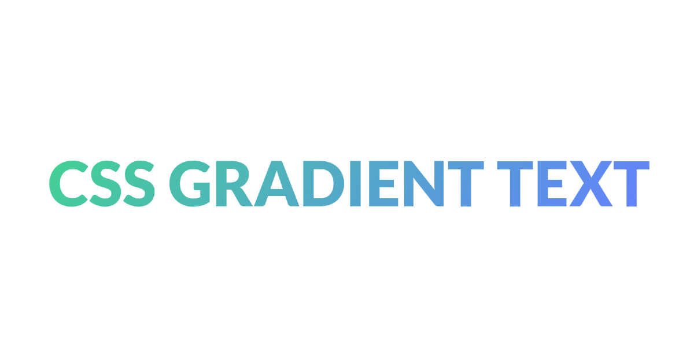

# CSS GRADIENT GENERATOR

🔗 checkout: live website](https://www.cssgradienttext.com/)

CSS gradient text is a free online gradient text generator.

It helps you to generate gradient text using CSS, modify it (change colors - angle), then simply copy-paste it into your code

## Framework

the project is built using [nuxt 3](https://v3.nuxtjs.org/), [tailwindcss](https://tailwindcss.com/). and deployed with [vercel](https://www.vercel.com/).

## Want to help ? 
feel free to open a discussion to report a bug, or request a new feature. Or make a PR!
